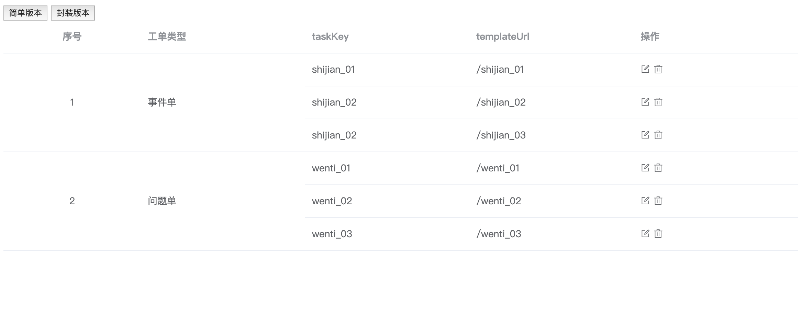
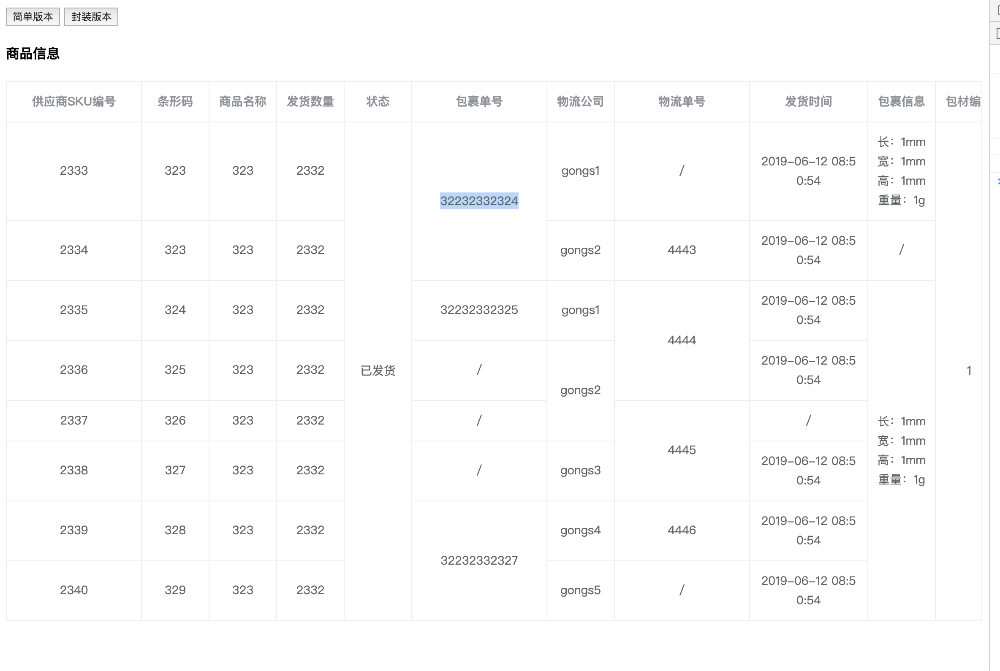

# element-starter

> 由vue-cli生成的Element UI的入门套件

*If you are familiar with [cooking](https://github.com/elemefe/cooking), [here](https://github.com/ElementUI/element-cooking-starter) is a starter generated with it*

## Environment

`Node >= 6`

## Start

 - Clone or download this repository
 - Enter your local directory, and install dependencies:

``` bash
yarn
```

## Develop

``` bash
# serve with hot reload at localhost:8010
npm run dev
```

## Build

``` bash
# build for production with minification
npm run build
```

## 需求背景
 - 最近使用element UI 的table 组件碰到一个需求，就是要纵向合并相同的单元格，官方提供了span-method 方法，
 - span-method 方法提供了四个参数 [官方链接](https://element.eleme.cn/#/zh-CN/component/table)
 - 后来经过百度找到一个思路很清晰的demo 拿过来改了下，就可以用了，但是后来发现会有很多table 组件用到这个方法，
 - [demo 博客地址](https://blog.csdn.net/hefeng6500/article/details/82778680) 最好先去看下这个博客，思路写的很清晰，我的思路就是照着博主的逻辑写的，因为博主写的很好，我也就不搬过来了
 - 自己的方法还是不够通用，所以决定封装一下。以后哪里用就直接调用方法就阔以了！
 - 那怎样才算是通用呢？ 先思考这个问题！
 - 我们都知道 element UI table 组件使用的时候el-table-column 标签上都会传一个prop属性， 对应的数据中的key
 - 正好 span-method 方法返回的四个参数中 { row, column, rowIndex, columnIndex } column参数对象下有一个property 属性，就是我们写的prop 的值
 - 我们可以吧要合并的key 值写成一个数组，作为参数传进去，然后内部一顿操作，把单元格合并，这种才算是通用吧！
 - 所以按照这个方向就开始搞了！

## 目录简介
 - src/components/simple.vue 简单版本
 - src/components/encapsulation.vue 封装过的版本
 - src/uitl.js 封装的方法
 - src/data.js 封装版用到的数据（数据格式有点乱，见谅！）

## 效果图
 - 简单版本 
 
 - 封装过的版本
 